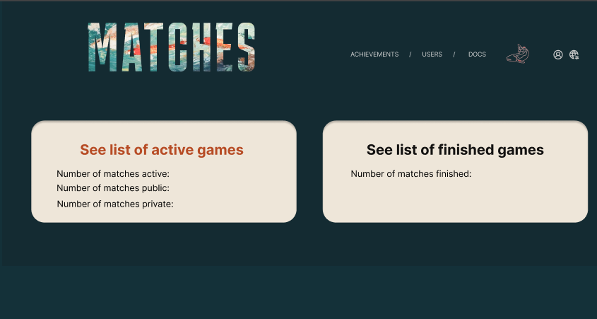
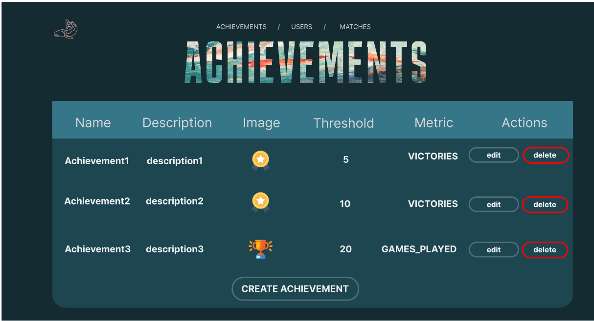
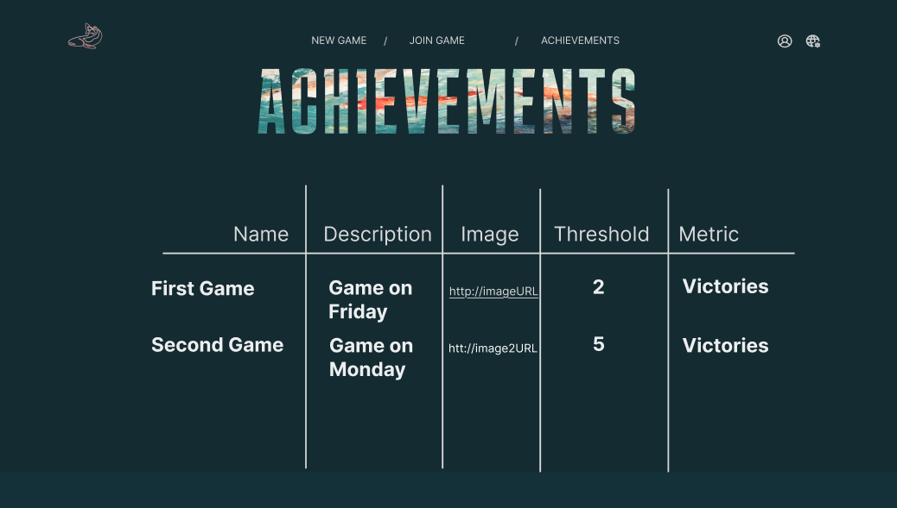
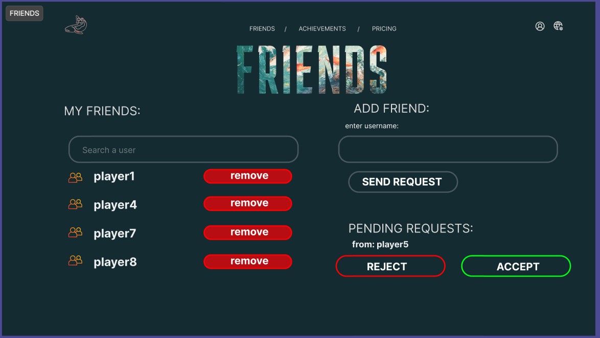
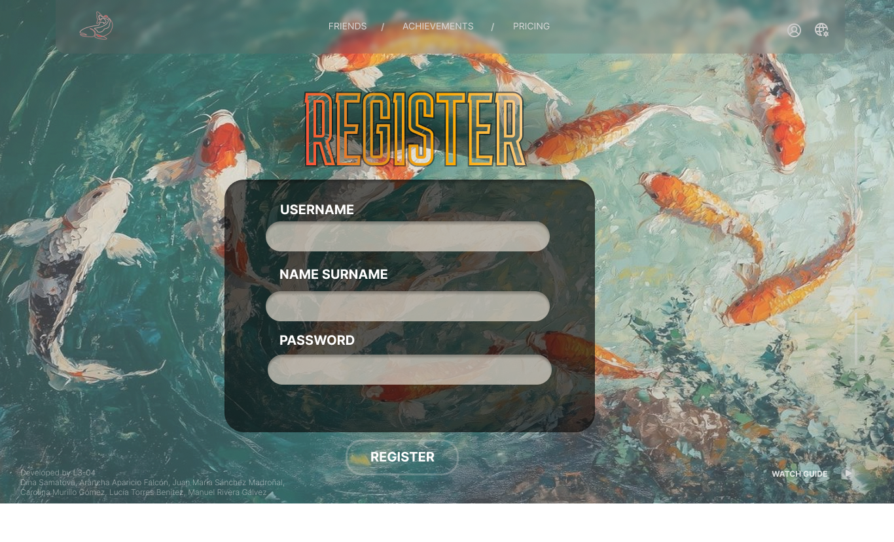
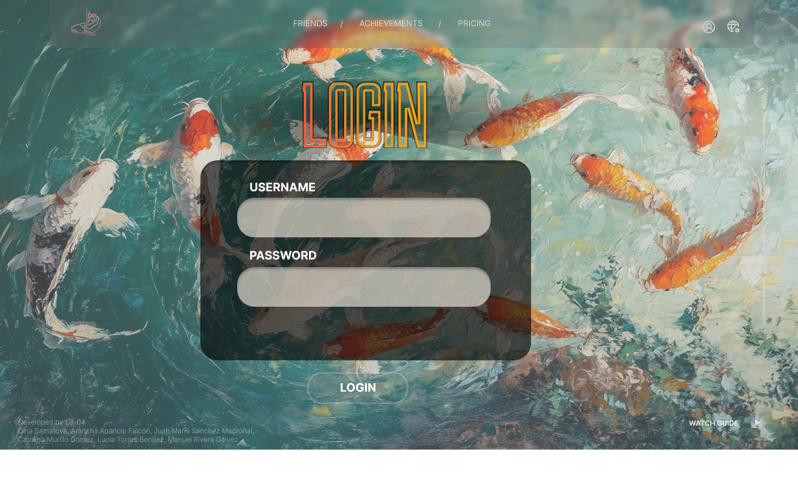

# Documento de análisis de requisitos del sistema

**Asignatura:** Diseño y Pruebas (Grado en Ingeniería del Software, Universidad de Sevilla)  
**Curso académico:** 2025/2026  
**Grupo/Equipo:** L3-04  
**Nombre del proyecto:** Upstream  
**Repositorio:** https://github.com/gii-is-DP1/dp1-2025-2026-l3-04  

**Integrantes (máx. 6):**

| Nombre y Apellidos | US-Id | Correo @us.es |
|--------------------|-------|---------------|
|Juan María Sánchez Madroñal | BJN1732 | juasanmad@alum.us.es|
| Dina Samatova| NHV4546| dinasam@alum.us.es|
|Arancha Aparicio Falcón |araapafal | araapafal@alum.us.es | 
|Lucía Torres Benitez |DKT3825|luctorben@alum.us.es |
|Carolina Murillo Gómez |XGC1564|carmurgom@alum.us.es                  |       |               |
|Manuel Rivera Gálvez |RPG8849|manrivgal@alum.us.es|

## Introducción

El proyecto presenta un juego de mesa en el que cada participante controla un banco de salmones que debe alcanzar su lugar de desove. La funcionalidad principal consiste en recrear, de forma estratégica, el viaje de estos peces, habiendo diversos obstáculos y depredadores como osos, águilas y garzas.

El valor del proyecto consiste en combinar la diversión con un reto de planificación y estrategia. El objetivo que se persigue es llegar con el mayor número posible de salmones a la zona de desove, optimizando los movimientos y evitando los obstáculos.

El juego está diseñado para entre 2 y 5 jugadores, a partir de 8 años, lo que lo hace accesible tanto para familias como para grupos de amigos. La duración media de cada partida es de 20 a 30 minutos, lo que permite jugar varias rondas sin resultar repetitivo.

La dinámica se desarrolla por turnos, cada jugador dispone de puntos de movimiento para avanzar a sus salmones, ya sea nadando o saltando. La partida termina cuando todos los salmones han alcanzado la zona de desove o han quedado en el intento.

La puntuación final se calcula en función de los salmones que cada jugador logre salvar y de los huevos depositados en el desove. El vencedor será aquel que sume más puntos. En caso de empate, se aplican criterios adicionales, como el número de salmones sobrevivientes o la posición más avanzada de sus fichas.

[Enlace al vídeo de explicación de las reglas del juego / partida jugada por el grupo](https://youtu.be/RARemHyFfRs)

## Tipos de Usuarios / Roles

**Jugador:** Usuario que participa en la partida de Upstream, controla a un grupo de salmones y toma decisiones estratégicas para avanzar río arriba.

**Administrador:**  Usuario con acceso completo al sistema web; gestiona cuentas de jugadores, sesiones de juego y estadísticas generales.

**Espectador:** Usuario que observa el desarrollo de una partida sin participar activamente. 

## Historias de Usuario – Upstream

### HU-01(Issue #39): Crear nueva partida ([https://github.com/orgs/gii-is-DP1/projects/259?pane=issue&itemId=131169471&issue=gii-is-DP1%7Cdp1-2025-2026-l3-04%7C39])
|Como **Jugador** quiero que el sistema me permita crear una nueva partida configurando el número de jugadores, para poder iniciar una sesión del juego con mis amigos.|
|-----|
|Mockup: |
|Descripción de interacciones:El jugador accede al menú principal, selecciona “Crear partida”, introduce el número de jugadores y confirma la creación. |

---

### HU-02(Issue #40): Visualizar partidas en curso ([https://github.com/orgs/gii-is-DP1/projects/259/views/1?pane=issue&itemId=131169742&issue=gii-is-DP1%7Cdp1-2025-2026-l3-04%7C40])
|Como **Administrador** quiero visualizar un listado de todas las partidas en curso con sus jugadores, para poder supervisar el estado y la actividad de la plataforma.|
|-----|
|Mockups: 

 |
|Descripción de interacciones:El administrador tendrá una pantalla en donde tendrá dos botones que seran la lista de juegos activos y juegos finalizados podra elegir que tipo de partidas quiere visualizar. 
A continuación pulsará el boton para ver las partidas activas y así supervisar el estado y la actividad. Tiene un botón join que te dejará unirte a la partida o al loby en modo admin. |

---

### HU-03(Issue #58): Unirse a partida existente ([https://github.com/orgs/gii-is-DP1/projects/259/views/1?pane=issue&itemId=132116131&issue=gii-is-DP1%7Cdp1-2025-2026-l3-04%7C58])
|Como **Jugador** quiero unirme a una partida existente mediante código, para poder jugar con otros.|
|-----|
|Mockups: |
|Descripción de interacciones:El jugador introduce el código proporcionado por otro jugador y el sistema lo agrega a la sala correspondiente. |

---

### HU-04(Issue #198): Invitar amigos a la partida.([https://github.com/orgs/gii-is-DP1/projects/259/views/1?pane=issue&itemId=136670330&issue=gii-is-DP1%7Cdp1-2025-2026-l3-04%7C198])
|Como **Jugador** quiero invitar a mis amigos a mi partida, para jugar con ellos directamente.|
|-----|
|Mockup: |
|Descripción de interacciones: Como jugador puedo invitar a mis amigos por codigo. Tendrá dos botones que permitirá empezar la partida o salirse del juego.|

---

### HU-05(Issue #117): Ver historial de partidas terminadas([https://github.com/orgs/gii-is-DP1/projects/259/views/1?pane=issue&itemId=135398593&issue=gii-is-DP1%7Cdp1-2025-2026-l3-04%7C117])
|Como **Administrador** quiero ver el historial de partidas terminadas, para mantener control de la actividad.|
|-----|
|Mockup: 

 |
|Descripción de interacciones: El administrador tendrá una pantalla en donde tendrá dos botones que seran la lista de juegos activos y juegos finalizados podra elegir que tipo de partidas quiere visualizar. A continuación pulsará el boton para ver las partidas finalizadas en donde saldrá el número de jugadores, el codigo, la fecha y dispondrá de un botón para ver los resultados.  |

---

### HU-06(Issue #199): Salir de la sala de espera([https://github.com/orgs/gii-is-DP1/projects/259/views/1?pane=issue&itemId=136670898&issue=gii-is-DP1%7Cdp1-2025-2026-l3-04%7C199])
|Como **Jugador** quiero salir de la sala de espera antes de que empiece la partida, para no quedar bloqueado si no puedo jugar.|
|-----|
|Mockup: |
|Descripción de interacciones: Como jugador puedo salir de la sala de espera dandole al boton "leave" .|

---

### HU-07: Unirse como espectador
|Como **Espectador** quiero unirme a una partida en modo observación, para seguir el desarrollo sin participar.|
|-----|
|Mockups: |
|Descripción de interacciones: |

---

### HU-08: Iniciar partida
|Como **Jugador** quiero iniciar la partida cuando todos estemos listos, para que comience el juego.|
|-----|
|Mockups: |
|Descripción de interacciones: |

---

### HU-09: Actualización del río
|Como **Jugador** quiero que, al final de cada ronda, el sistema retire las losetas iniciales del río y añada nuevas losetas río arriba, para que el tablero se actualice automáticamente según las reglas.|
|-----|
|Mockups: |
|Descripción de interacciones: |

---

### HU-10: Elegir tipo de movimiento
|Como **Jugador** quiero elegir un tipo de movimiento (nadar o saltar), para progresar en el río.|
|-----|
|Mockups: |
|Descripción de interacciones: |

---

### HU-11: Aviso de movimiento no permitido
|Como **Jugador** quiero que el sistema me avise si intento hacer un movimiento no permitido, para no romper las reglas.|
|-----|
|Mockups: |
|Descripción de interacciones: |

---

### HU-12: Mover salmón en el tablero
|Como **Jugador** quiero mover mi salmón en el tablero tras elegir movimiento, para avanzar en la partida.|
|-----|
|Mockups: |
|Descripción de interacciones: |

---

### HU-13: Impedir movimiento a casilla llena
|Como **Jugador** quiero que el sistema me impida moverme a una casilla llena (capacidad máxima), para respetar las reglas.|
|-----|
|Mockups: |
|Descripción de interacciones: |

---

### HU-14: Distribuir puntos de movimientos
|Como **Jugador** quiero distribuir mis 5 movimientos entre diferentes salmones, para aplicar estrategia.|
|-----|
|Mockups: |
|Descripción de interacciones: |

---

### HU-15: Contador visual de movimientos
|Como **Jugador** quiero ver un contador visual de movimientos restantes en mi turno, para no confundirme.|
|-----|
|Mockups: |
|Descripción de interacciones: |

---

### HU-16: Fin automático del turno
|Como **Jugador** quiero que mi turno termine automáticamente al gastar los 5 movimientos, para mantener el flujo del juego.|
|-----|
|Mockups: |
|Descripción de interacciones: |

---

### HU-17: Notificación de turno
|Como **Jugador** quiero recibir una notificación clara de “es tu turno”, para no perder la acción.|
|-----|
|Mockups: |
|Descripción de interacciones: |

---

### HU-18: Ver movimientos de otros jugadores
|Como **Jugador** quiero ver en tiempo real los movimientos de otros jugadores, para seguir el flujo de la partida.|
|-----|
|Mockups: |
|Descripción de interacciones: |

---

### HU-19: Casillas de Águila
|Como **Jugador** quiero que, si mi salmón termina en una casilla de Águila, pierda un salmón y el águila desaparezca, para cumplir las reglas.|
|-----|
|Mockups: |
|Descripción de interacciones: |

---

### HU-20: Casillas de Oso
|Como **Jugador** quiero que, si salto desde o hacia una casilla de Oso, pierda un salmón, para representar el ataque del oso.|
|-----|
|Mockups: |
|Descripción de interacciones: |

---

### HU-21: Casillas de Garza Azul
|Como **Jugador** quiero que, si termino en una casilla de Garza Azul, pierda un salmón al final de mi turno, para reflejar su efecto.|
|-----|
|Mockups: |
|Descripción de interacciones: |

---

### HU-22: Cascadas solo saltando
|Como **Jugador** quiero que las Cascadas sólo puedan ser superadas saltando, para mantener las reglas originales.|
|-----|
|Mockups: |
|Descripción de interacciones: |

---

### HU-23: Entrar en partida en curso
|Como **Administrador** quiero entrar en cualquier partida en curso, para comprobar que se cumplen las reglas.|
|-----|
|Mockups: |
|Descripción de interacciones: Selecciono cualquier partida que este en el estado waiting o en el estado playing, me aparecera un boton que me dejara unirme y ver la partida en curso.|

---

### HU-24: Detectar fin de partida
|Como **Jugador** quiero que el sistema detecte automáticamente el final de la partida, cuando todos los salmones estén en la zona de desove o eliminados.|
|-----|
|Mockups: |
|Descripción de interacciones: |

---

### HU-25: Puntos por huevos en desove
|Como **Jugador** quiero que al final de la partida mis salmones en casillas de desove con huevos me den puntos, para calcular la puntuación final.|
|-----|
|Mockups: |
|Descripción de interacciones: |

---

### HU-26: Puntos por salmones supervivientes
|Como **Jugador** quiero que cada salmón superviviente me dé puntos adicionales, para sumar a mi puntuación final.|
|-----|
|Mockups: |
|Descripción de interacciones: |

---

### HU-27: Ver total de puntos
|Como **Jugador** quiero ver en pantalla el total de mis puntos al terminar la partida, para conocer mi resultado.|
|-----|
|Mockups: |
|Descripción de interacciones: |

---

### HU-28: Ver puntuaciones globales
|Como **Administrador** quiero ver una tabla con las puntuaciones finales de todos los jugadores, para registrar los resultados.|
|-----|
|Mockups: 
 |
|Descripción de interacciones: El administrador puede ver una tabla con los nombres de los usuarios y su gmail, con los puntos correspondientes de cada jugador y el vencedor de la partida. Dispondrá de información más específica de la partida y un botón que le deja volver a la pantalla de la lista de partidas.|

---

### HU-29: Consultar historial personal ([https://github.com/orgs/gii-is-DP1/projects/259/views/1?pane=issue&itemId=135399442&issue=gii-is-DP1%7Cdp1-2025-2026-l3-04%7C140])
|Como **Jugador** quiero consultar mi historial de partidas jugadas, para revisar mis progresos.|
|-----|
|Mockups: 
|
|Descripción de interacciones: El jugador seleccionará la ópcion "Games Played", dónde podrá ver una lista con las partidas jugadas.|

---

### HU-30(Issue #141): Ver estadísticas personales([https://github.com/gii-is-DP1/dp1-2025-2026-l3-04/issues/141])
|Como **Jugador** quiero ver mis estadísticas personales (número de partidas, victorias, puntos promedio), para conocer mi rendimiento.|
|-----|
|Mockups: |
|Descripción de interacciones: El usuario visualiza un panel con sus métricas personales agregadas: partidas jugadas, victorias, derrotas, puntos promedio, puntos máximos y mínimos, duración media, tiempo total de juego y logros. Los valores se calculan automáticamente a partir del historial de partidas del jugador y se actualizan al finalizar cada partida. No hay búsqueda ni comparación con otros usuarios. |

---

### HU-31(Issue #142): Ranking global([https://github.com/gii-is-DP1/dp1-2025-2026-l3-04/issues/142])
|Como **Jugador** quiero consultar un ranking global de jugadores por puntuación acumulada, para comparar mi nivel.|
|-----|
|Mockups: 
 |
|Descripción de interacciones: El usuario puede ver una tabla con los nombres de otros usuarios y sus emails además de los puntos totales de cada uno y sus diferentes posiciones ordenadas de manera descendente destacando el top 3. Dispondrá de un navegador con el que buscar su posición o la de otros usuarios al introducir sus nombres. |

---

### HU-32(Issue #143): Ver estadísticas globales([https://github.com/gii-is-DP1/dp1-2025-2026-l3-04/issues/143])
|Como **Jugador** quiero ver un panel con estadísticas globales de las partidas para entender el nivel general y la actividad de la comunidad.|
|-----|
|Mockups:|
|Descripción de interacciones: El usuario abre la vista Statistics en modo global. Se muestran tarjetas con métricas agregadas: Games recorded, Participations, Avg points, Min points, Max points, Avg players per game. Los valores se recalculan automáticamente al finalizar cada partida y al cargar la página. Vista solo-lectura, sin filtros ni búsqueda. |

---

### HU-33: Desbloquear logros
|Como **Jugador** quiero desbloquear logros  del juego, para enriquecer la experiencia.|
|-----|
|Mockups: |
|Descripción de interacciones: |

---

### HU-34(Issue #145): Definir criterios de logros([https://github.com/gii-is-DP1/dp1-2025-2026-l3-04/issues/145])
|Como **Administrador** quiero definir criterios de logros, para mantener la dinámica del juego.|
|-----|
|Mockups: 
|
|Descripción de interacciones: el administrador pulsa el botón de crear logro y le aparecera la pantalla para poder crear un nuevo logro. En esta pantalla el administrador puede crear el logro poniendo un nuevo nombre, descripción, url de la imagen y el valor al conseguir el logro. También tendrá la posibilidad de poner las diferentes opciones de metrica. Además de dos botones para guardar o cancelar el logro. |

---

### HU-35(Issue #146): Ver logros personales ([https://github.com/gii-is-DP1/dp1-2025-2026-l3-04/issues/146])
|Como **Jugador** quiero tener una página dedicada con todos mis logros, para ver mi progreso personal.|
|-----|
|Mockups: |
|Descripción de interacciones: El jugador selecciona "Achievements", dónde podrá ver una lista con los logros de sus partidas. |

---

### HU-36(Issue #147): Enviar solicitudes de amistad([https://github.com/gii-is-DP1/dp1-2025-2026-l3-04/issues/147])
|Como **Jugador** quiero enviar solicitud de amistad, para ampliar mi red de juego.|
|-----|
|Mockups: |
|Descripción de interacciones: el jugador tendrá un buscador donde podrá poner el nombre del usuario y así mandarle una solicitud de amistad, pulsando en el botón de "SEND REQUEST".|

---

### HU-37(Issue #148): Poder ver lista de amigos([https://github.com/gii-is-DP1/dp1-2025-2026-l3-04/issues/148])
|Como **Jugador** quiero ver la lista de amigos que tengo para poder saber cuales estan en linea o invitarlos a partida|
|-----|
|Mockups: |
|Descripción de interacciones: El jugador podra ver una lista de todos los amigos que tiene. |

---

### HU-38: Reacciones de espectadores
|Como **Espectador** quiero mostrar mi apoyo a un jugador (reacciones simples), para que sienta mi presencia en la partida.|
|-----|
|Mockups: |
|Descripción de interacciones: |

---

### HU-39: Ver tablero como espectador
|Como **Espectador** quiero ver el tablero en tiempo real sin intervenir, para disfrutar la experiencia de observación.|
|-----|
|Mockups: |
|Descripción de interacciones: |

---

### HU-40: Chat durante la partida
|Como **Jugador** quiero usar un chat durante la partida (general), para comunicarme con los demás en tiempo real.|
|-----|
|Mockups: |
|Descripción de interacciones: |

---

### HU-41(Issue #60): Editar perfil ([https://github.com/gii-is-DP1/dp1-2025-2026-l3-04/issues/60])
|Como **Jugador** quiero editar mi perfil (avatar y nick), para personalizar mi experiencia.|
|-----|
|Mockups: 
 |
|Descripción de interacciones: El jugador puede ver en la opción "My profile" los datos de su perfil, como nombre, nick, mail y contraseña. Además de poder editar dichos datos o cerrar sesión.|

---

### HU-42(Issue #194): Aceptar solicitud de amistad.([https://github.com/gii-is-DP1/dp1-2025-2026-l3-04/issues/194])
|Como **Jugador** quiero tener un botón en cada solicitud de amistad que me permita aceptarla para agregar al jugador a mi lista de amigos y ampliar mi red de juego.|
|-----|
|Mockups:  |
|Descripción de interacciones: Cuando el jugador recibe una solicitud de amistad, se muestra un botón “Accept” junto al nombre del remitente para poder añadirlo a su lista de amigos.|

---

### HU-43(Issue #195): Rechazar solicitud de amistad.([https://github.com/gii-is-DP1/dp1-2025-2026-l3-04/issues/195])
|Como **Jugador** quiero tener un botón en cada solicitud de amistad que me permita rechazarla para rechazar al jugador.|
|-----|
|Mockups:  |
|Descripción de interacciones:Cuando el jugador recibe una solicitud de amistad, se muestra un botón "Rejected" junto al nombre del remitente y así no tenerlo como amigo. |

---
### HU-44(Issue #196): Eliminar amigo de lista de amigos.([https://github.com/gii-is-DP1/dp1-2025-2026-l3-04/issues/196])
|Como **Jugador** quiero tener un botón de eliminar para poder eliminar una amistad de mi lista de amigos.|
|-----|
|Mockups: |
|Descripción de interacciones: El jugador tendrá una lista de amigos y al lado de cada amigo le aparecerá un botón "remove" y así podrá eliminar el usuario como amigo. |

---

### HU-45(Issue #197): Buscar por nombre de usuario dentro de la lista de amigos.([https://github.com/gii-is-DP1/dp1-2025-2026-l3-04/issues/197])
|Como **Jugador** quiero poder buscar amigos dentro de mi lista de amigos mediante un campo de búsqueda, para encontrarlos fácilmente sin tener que recorrer toda la lista.|
|-----|
|Mockups: |
|Descripción de interacciones:El jugador podrá buscar en un buscador el nombre del usuario que quiera encontrar en la lista de amigos. |

---

### HU-46(Issue #211): Editar Logros ([https://github.com/gii-is-DP1/dp1-2025-2026-l3-04/issues/211])
|Como **Administrador** quiero poder editar los criterios de logros ya creados.|
|-----|
|Mockups: 
|
|Descripción: El administrador puede pulsar el boton de editar el logro y le mandara a la página de editar el logro. Le apareceran los campos con los datos del logro que podrá editar y tendrá dos botones: uno para guardar el logro y otro para cancelar. |
---

## HU-47(Issue #212): Eliminar Logros ([https://github.com/gii-is-DP1/dp1-2025-2026-l3-04/issues/212])
|Como **Administrador** quiero poder eliminar logros.|
|-----|
|Mockups: |
|Descripción: El administrador puede eliminar el logro que quiera seleccionando el boton de eliminar que aparece a la derecha del todo. |
---
## HU-48 (Issue #220): Register ([https://github.com/gii-is-DP1/dp1-2025-2026-l3-04/issues/220])
|Como **User** quiero poder registrarme para crear una cuenta y jugar.
|
|-----|
|Mockups: |
|Descripción: El usuario completa un formulario con username, email y password y confirma el registro. Si los datos son válidos y el username/email no existen, el sistema crea la cuenta y redirige al inicio con sesión iniciada. |
---
## HU-49 (Issue #221): Log in ([https://github.com/gii-is-DP1/dp1-2025-2026-l3-04/issues/221])
|Como **Usuario** registrado quiero poder iniciar sesión para acceder a mis funcionalidades.|
|-----|
|Mockups: |
|Descripción: El usuario introduce username/email y password. Si las credenciales son correctas, el sistema genera el JWT, lo guarda en el cliente y redirige al Home. Si son incorrectas, muestra un mensaje de error. |
---
## HU-50(Issue #222): Log out ([https://github.com/gii-is-DP1/dp1-2025-2026-l3-04/issues/222])
|Como **Usuario** autenticado quiero poder cerrar sesión de forma segura.|
|-----|
|Mockups: |
|Descripción:  Al pulsar el botón LOG OUT, el sistema invalida la sesión en cliente (elimina JWT y datos de usuario), avisa al backend, y redirige a la pantalla de Home público.|

----------

## Diagrama conceptual del sistema

Diagrama conceptual del sistema: 
## Reglas de Negocio
| Nº Regla | Descripción |
|----------|-------------|
| R1 | Para poder iniciar una partida debes registrarte previamente e iniciar sesións como jugador. |
| R2 | Cada jugador debe tener acceso a su información personal para poder editar su perfil, así como al registro de partidas jugadas (ganadas y perdidas). |
| R3 | El correo electrónico debe ser único por usuario y además debe verificarse antes de crear o unirse a una partida. |
| R4 | Solo el administrador puede eliminar o suspender usuarios, pero el administrador no puede ser eliminado de la partida. |
| R5 | Cada jugador debe poder acceder a un listado de partidas clasificadas por estado (en curso, finalizadas) y debería poder unirse a alguna. |
| R6 | Cada jugador dispone obligatoriamente de 5 puntos de movimiento (siempre hacia delante) por turno (salvo excepciones en partida a 2 jugadores). El movimiento puede ser nadando (1 punto por loseta) o saltando (1 de acción + 1 por cada loseta saltada). |
| R7 | Los salmones se mueven en fichas (pareja o solitario), no de manera individual. |
| R8 | Una loseta regular solo puede contener tantas fichas de salmón como jugadores haya en la partida; si está llena, no se puede entrar nadando ni detenerse en ella. Una loseta obstáculo puede contener como máximo el número de jugadores - 1. |
| R9 | Amenazas:  • Águilas: si un salmón entra nadando o cae al final de un salto en su loseta, pierde un salmón. La loseta se voltea (ya no es peligrosa).  • Osos: si un salmón salta hacia, desde o sobre la loseta, pierde un salmón. Si pasa nadando, no lo afecta. El oso nunca desaparece.  • Garzas: al final de tu turno, pierdes un salmón por cada ficha tuya en losetas de garza. No se retiran nunca. |
| R10 | La partida termina por alguna de las siguientes razones:  • Todos los salmones han llegado a la zona de desove.  • Todos los salmones han muerto.  • El tablero se ha formado completamente y ya no quedan más fichas que añadir al final. |
| R11 | Puntuación: +1 punto por salmón vivo y +1 punto por cada huevo en la casilla de desove ocupada por tu ficha. En caso de empate, gana primero quien tenga más salmones vivos, luego quien tenga más fichas, y finalmente quien tenga las fichas más adelantadas. |
| R12 | El ranking debe actualizarse a la vez que se actualizan los promedios en tiempo real al finalizar cada partida. |
| R13 | Cada partida podrá llevarse a cabo por un máximo de 5 jugadores. |
| R14 | Un jugador solo puede enviar solicitudes de amistad a usuarios registrados que aún no sean amigos. |
| R15 | Las invitaciones a partidas solo pueden enviarse a amigos confirmados y solo los amigos de todos los jugadores pueden acceder al modo espectador. |
| R16 | El chat público debe estar disponible solo durante las partidas en curso y los mensajes deben moderarse para evitar contenido inapropiado. |
| R17 | Al final de cada ronda, se eliminan las últimas losetas del río y se colocan nuevas en la parte superior, excepto en la primera ronda y en partidas de 2 jugadores.|
| R18 | En la variante “Remolino”, las losetas de Roca obligan a detener el movimiento de la ficha de salmón al entrar. Esta variante puede aplicarse en partidas de 2 a 5 jugadores.|
| R19 | Las losetas de Rápidos pueden añadirse al juego o sustituir otras losetas (recomendado: Garza, Águila y una de Roca). Al nadar hacia una loseta de Rápidos, la ficha de salmón se desplaza automáticamente una loseta en la dirección indicada, sin gastar puntos de movimiento.  •Si la loseta de destino está llena, la ficha se moverá allí gratuitamente en el siguiente turno del jugador.  •Si hay un Salto de Agua en la loseta de destino, el jugador deberá gastar 1 punto adicional si le quedan; si no, lo hará en su siguiente turno.  •Si la ficha salta por encima de la loseta de Rápidos, esta no le afecta.  •Las losetas de Rápidos deben colocarse apuntando a una loseta accesible legalmente (nunca hacia fuera del río ni siguiendo la corriente). |
| R20 | El sistema debe guardar automáticamente cada partida terminada para que el jugador pueda verla en su historial.|
| R21 | El jugador solo puede ver su propio historial de partidas.|
| R22 | El sistema debe mostrar los logros del jugador para que el jugador pueda verlo en su historial de victorias.|

