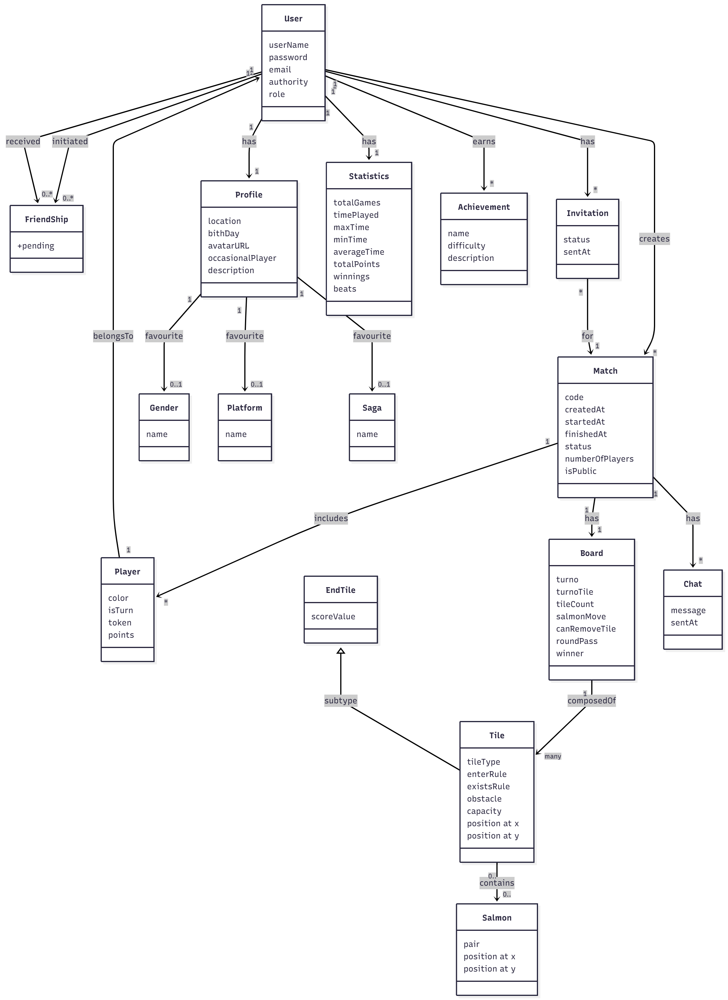
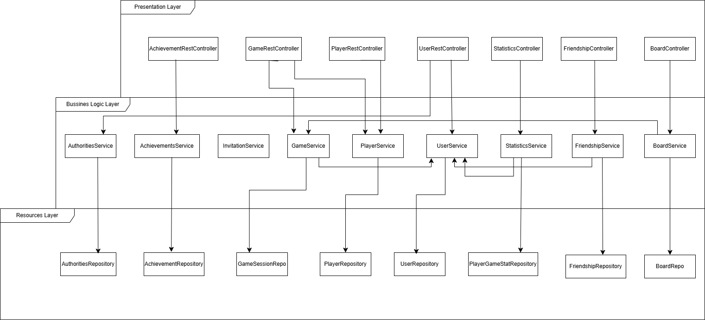

# Documento de diseño del sistema
**Asignatura:** Diseño y Pruebas (Grado en Ingeniería del Software, Universidad de Sevilla)  
**Curso académico:** 2025/2026  
**Grupo/Equipo:** L3-04  
**Nombre del proyecto:** Upstream  
**Repositorio:** https://github.com/gii-is-DP1/dp1-2025-2026-l3-04  

**Integrantes (máx. 6):**

| Nombre y Apellidos | US-Id | Correo @us.es |
|--------------------|-------|---------------|
|Juan María Sánchez Madroñal | BJN1732 | juasanmad@alum.us.es|
| Dina Samatova| NHV4546| dinasam@alum.us.es|
|Arancha Aparicio Falcón | araapafal | araapafal@alum.us.es | 
|Lucía Torres Benitez |DKT3825|luctorben@alum.us.es |
|Carolina Murillo Gómez |XGC1564|carmurgom@alum.us.es                  |       |               |
|Manuel Rivera Gálvez |RPG8849|manrivgal@alum.us.es|

## Introducción

El proyecto presenta un juego de mesa en el que cada participante controla un banco de salmones que debe alcanzar su lugar de desove. La funcionalidad principal consiste en recrear, de forma estratégica, el viaje de estos peces, habiendo diversos obstáculos y depredadores como osos, águilas y garzas.

El valor del proyecto consiste en combinar la diversión con un reto de planificación y estrategia. El objetivo que se persigue es llegar con el mayor número posible de salmones a la zona de desove, optimizando los movimientos y evitando los obstáculos.

El juego está diseñado para entre 2 y 5 jugadores, a partir de 8 años, lo que lo hace accesible tanto para familias como para grupos de amigos. La duración media de cada partida es de 20 a 30 minutos, lo que permite jugar varias rondas sin resultar repetitivo.

La dinámica se desarrolla por turnos, cada jugador dispone de puntos de movimiento para avanzar a sus salmones, ya sea nadando o saltando. La partida termina cuando todos los salmones han alcanzado la zona de desove o han quedado en el intento.

La puntuación final se calcula en función de los salmones que cada jugador logre salvar y de los huevos depositados en el desove. El vencedor será aquel que sume más puntos. En caso de empate, se aplican criterios adicionales, como el número de salmones sobrevivientes o la posición más avanzada de sus fichas.

[Enlace al vídeo de explicación de las reglas del juego](https://youtu.be/RARemHyFfRs)

## Diagrama(s) UML:

### Diagrama de Dominio/Diseño

### Diagrama de Capas (incluyendo Controladores, Servicios y Repositorios)

## Descomposición del mockups del tablero de juego en componentes

En esta sección procesaremos el mockup del tablero de juego (o los mockups si el tablero cambia en las distintas fases del juego). Etiquetaremos las zonas de cada una de las pantallas para identificar componentes a implementar. Para cada mockup se especificará el árbol de jerarquía de componentes, así como, para cada componente el estado que necesita mantener, las llamadas a la API que debe realizar y los parámetros de configuración global que consideramos que necesita usar cada componente concreto. 
Por ejemplo, para la pantalla de visualización de métricas del usuario en un hipotético módulo de juego social:

  - App – Componente principal de la aplicación
    - $\color{orange}{\textsf{NavBar – Barra de navegación lateral}}$
      - $\color{darkred}{\textsf{[ NavButton ]. Muestra un botón de navegación con un icono asociado.}}$
    - $\color{darkblue}{\textsf{UserNotificationArea – Área de notificaciones e identificación del usuario actual}}$
    - $\color{blue}{\textsf{MetricsBar – En este componente se muestran las métricas principales del juego. Se mostrarán 4 métricas: partidas jugadas, puntos logrados, tiempo total, y cartas jugadas.}}$
      - $\color{darkgreen}{\textsf{[ MetricWell ] – Proporciona el valor y el incremento semanal de una métrica concreta. }}$
    - $\color{purple}{\textsf{GamesEvolutionChart – Muestra la tendencia de evolución en ellos últimos 4 meses en cuanto a partida jugadas, ganadas, perdidas y abandonadas.}}$
    - $\color{yellow}{\textsf{PopularCardsChart – Muestra la proporción de las N (parámetro de configuración) cartas más jugadas en el juego por el jugador.}}$
    - $\color{red}{\textsf{FrequentCoPlayersTable – Muestra los jugadores  con los que más se  ha jugado (de M en M donde M es un parámetro definido por la configuración del componente). Concretamente, se mostrarán la el nombre, la fecha de la última partida, la localización del jugador el porcentaje de partidas jugadas por ambos en las que el usuario ha ganado y si el jugador es amigo o no del usuario.}}$

## Patrones de diseño y arquitectónicos aplicados
En esta sección de especificar el conjunto de patrones de diseño y arquitectónicos aplicados durante el proyecto. Para especificar la aplicación de cada patrón puede usar la siguiente plantilla:

### Patrón: < Nombre del patrón >
*Tipo*: Arquitectónico | de Diseño

*Contexto de Aplicación*

Describir las partes de la aplicación donde se ha aplicado el patrón. Si se considera oportuno especificar el paquete donde se han incluido los elementos asociados a la aplicación del patrón.

*Clases o paquetes creados*

Indicar las clases o paquetes creados como resultado de la aplicación del patrón.

*Ventajas alcanzadas al aplicar el patrón*

Describir porqué era interesante aplicar el patrón.

## Decisiones de diseño

### Decisión 1: Método para unirse a una partida existente (HU-03)
#### Descripción del problema:*

Al implementar la funcionalidad que permite a los jugadores unirse a partidas existentes, surgió la necesidad de decidir cómo realizar esa unión a nivel de código. Podíamos permitir que el usuario introdujera un código en un formulario o generar enlaces únicos que incluyeran el identificador de la partida y un token de seguridad.

#### Alternativas de solución evaluadas:
*Alternativa 1.a*: Unirse mediante código introducido manualmente.

  *Ventajas*:
    - Implementación sencilla: solo requiere un campo de entrada y una llamada REST.
    - No requiere generar ni almacenar tokens adicionales.
  *Inconvenientes*:
    - Menor comodidad para el usuario, especialmente en móviles.
    - Requiere una pantalla adicional para introducir el código.

*Alternativa 1.b*: Unirse mediante enlace directo.
  *Ventajas*:
    - Simplifica la UX: basta con hacer clic en el enlace.
    - Permite compartir la partida fácilmente por aplicaciones externas.
    - Puede integrarse con un middleware de validación de tokens.
  *Inconvenientes*:
    - Requiere generar y validar tokens temporales en backend.
    - Se debe gestionar la caducidad y seguridad del token en backend.

#### Justificación de la solución adoptada

Se eligió la alternativa 1.a (introducir código manualmente) por su simplicidad y menor carga de desarrollo.
A nivel de implementación, el frontend muestra un formulario donde el jugador introduce el código, que se envía al backend para validarlo. Si el código es correcto, se recupera la partida correspondiente y se asocia el jugador.
Esta solución facilita el mantenimiento, minimiza errores de seguridad y permite añadir el sistema de enlaces en versiones futuras si se desea mejorar la experiencia.

### Decisión 2: Método de invitación a amigos (HU-04)
#### Descripción del problema:

Durante la implementación de la funcionalidad de invitaciones, fue necesario decidir cómo los jugadores podrían compartir su partida con otros.
El sistema podía limitarse a compartir un código único o generar también un enlace directo para unirse automáticamente. Se debía definir cuál opción se integraba mejor con la lógica de backend y la interfaz de usuario.

#### Alternativas de solución evaluadas:

*Alternativa 2.a*: Compartir código manual
  *Ventajas*:
    - Reutiliza la lógica existente de HU-03 (validación por código).
    - No necesita endpoints adicionales.
  *Inconvenientes*:
    - Requiere copiar el código y enviarlo manualmente al amigo.
    - No permite control de expiración ni seguimiento de invitaciones.

*Alternativa 2.b*: Generar enlace de invitación con token
  *Ventajas*:
    - Facilita compartir mediante un enlace.
    - Posibilidad de registrar invitaciones en una entidad Invitation.
    - Control de caducidad y validación más segura.
  *Inconvenientes*:
    - Requiere implementar generación y validación de tokens en backend.
    - Añade una capa extra de complejidad al modelo y la seguridad.

*Alternativa 2.c*: Implementar ambas opciones (código + enlace)
  *Ventajas*:
    - Combina comodidad (enlace) y seguridad (código manual).
    - Permite mantener compatibilidad con sistemas que solo aceptan códigos.
    - La generación del enlace se basa en el mismo código, por lo que no duplica lógica.
  *Inconvenientes*:
    - Requiere controlar ambas rutas en frontend y backend.
    - Ligeramente mayor esfuerzo de mantenimiento.

#### Justificación de la solución adoptada

Se adoptó la alternativa 2.c (código + enlace) porque permite una solución equilibrada entre simplicidad y usabilidad.
Desde el punto de vista técnico, ambos métodos comparten la misma base de datos, por lo que no duplican lógica ni aumentan la complejidad del backend.
El código manual asegura compatibilidad con cualquier interfaz (por ejemplo, consola o API externa), mientras que el enlace directo mejora la experiencia del usuario final al permitir unirse con un solo clic.
Además, esta combinación facilita la escalabilidad: en futuras versiones, el enlace podrá incluir tokens de seguridad o caducidad temporal sin modificar la estructura actual.
De esta forma, la solución elegida mantiene un backend sencillo y un frontend intuitivo.

### Decisión 3: Acceso de espectadores a partidas (HU-07)
#### Descripción del problema: 

Había que determinar cómo permitir que los espectadores se unan a partidas sin participar, en modo observación.
Las opciones eran usar el mismo endpoint que los jugadores, añadiendo un rol “espectador”, o crear un endpoint independiente con permisos de solo lectura.

#### Alternativas de solución evaluadas:

*Alternativa 3.a*: Reutilizar endpoint /join con rol “spectator”
  *Ventajas*:
    - Reutiliza la lógica ya existente.
    - Menor número de rutas y menor duplicación de código.
  *Inconvenientes*:
    - Se complica la gestión de roles en backend (PLAYER vs SPECTATOR).
    - Mayor riesgo de conflictos o errores de validación.

*Alternativa 3.b*: Crear endpoint específico 
  *Ventajas*:
    - Separa totalmente la lógica.
    - Permite establecer permisos de solo lectura (no acciones de movimiento).
    - Facilita mantener el control de accesos.
  *Inconvenientes*:
    - Duplica parcialmente la lógica de carga de partida.
    - Requiere crear un nuevo servicio en backend y adaptar el frontend.

#### Justificación de la solución adoptada

// TODO
Aún no ha sido implementada ésta HU, por lo que no sabemos que opción usaremos finalmente.

### Decisión 4: Implementación del tablero del juego (HU-09)
#### Descripción del problema: 

Se debía definir cómo generar y actualizar el tablero del juego (río con losetas). Había dos opciones: mantener un tablero fijo precargado o generar las losetas dinámicamente según el progreso del juego.

#### Alternativas de solución evaluadas:

*Alternativa 4.a*: Tablero fijo precargado
  *Ventajas*:
    - Estructura estática en BD o archivo JSON.
    - Menor complejidad de actualización en cada turno.
    - Mejor rendimiento en frontend y backend.
  *Inconvenientes*:
    - Menor flexibilidad si cambia el número de jugadores o la dificultad.
    - Requiere simular la desaparición de losetas en vez de regenerarlas.

*Alternativa 4.b*: Tablero dinámico generado en tiempo real
  *Ventajas*:
    - Permite personalizar el tablero por partida.
    - Posibilita nuevas mecánicas y eventos dinámicos.
  *Inconvenientes*:
    - Mayor complejidad en backend: necesita servicios de generación y sincronización.
    - Incrementa el riesgo de desincronización.

#### Justificación de la solución adoptada

// TODO
Aún no ha sido implementada ésta HU, por lo que no sabemos que opción usaremos finalmente.

### Decisión 5: Envío de solicitudes de amistad (HU-36)
#### Descripción del problema: 

Debíamos implementar cómo un jugador envía y acepta solicitudes de amistad. A nivel de implementación había que decidir qué identificador usar para dirigir la solicitud: introducir un identificador manual, como puede ser un nombre de usuario, o seleccionar desde una lista de amigos ó sugerencias.

#### Alternativas de solución evaluadas:

*Alternativa 5.a*: Envío de solicitud por nombre de usuario 
  *Ventajas*:
    - Implementación sencilla: el frontend solo necesita un campo de texto para escribir el nombre y un botón de “Enviar”.
    - El backend puede validar fácilmente si el usuario existe antes de registrar la solicitud.
    - Requiere poco mantenimiento y es fácil de probar.
  *Inconvenientes*:
    - El usuario debe recordar y escribir correctamente el nombre del otro jugador.
    - No ofrece sugerencias ni autocompletado, lo que puede dificultar encontrar amigos nuevos.

*Alternativa 5.b*: Envío de solicitud por lista de amigos o de sugerencias
  *Ventajas*:
    - Mejor experiencia para el jugador: puede seleccionar a sus amigos desde una lista o buscador, sin escribir manualmente el nombre.
    - Reduce errores de escritura y mejora la usabilidad.
  *Inconvenientes*:
    - Requiere desarrollar una lista o buscador en el frontend, lo que implica más tiempo y trabajo.
    - En el backend hay que crear nuevos endpoints para mostrar y filtrar usuarios.
    - Aumenta ligeramente el consumo de recursos del servidor por las búsquedas.

#### Justificación de la solución adoptada

// TODO
Aún no ha sido implementada ésta HU, por lo que no sabemos que opción usaremos finalmente.

## Refactorizaciones aplicadas

### Refactorización De La Visualización De Las Partidas:
En esta refactorización decidimos separar el código y la manera de visualizar las partidas ya que, anteriormente, se visualizaban tanto las partidas activas como las que ya han finalizado. Sin embargo, ahora se visualizan por separado unas u otras.

Debido a la longitud del código (ya que se han modificados ficheros enteros) adjuntaremos imágenes de las modificaciones para identificar y comprender los cambios más fácilmente.

#### Estado inicial del código

#### Estado del código refactorizado

#### Problema que nos hizo realizar la refactorización
No seguían el diseño que pensábamos implementar en un principio ni cubrían correctamente las HU anteriormente declaradas.

#### Ventajas que presenta la nueva versión del código respecto de la versión original
Ahora si se cumple con lo que se esperaba del proyecto.

### Refactorización de Friends:
En esta refactorización no solo modificamos código como tal, si no que también hemos cambiado la distribución de algunas carpetas, hemos creado una nueva entidad a la que denominamos Friendship y hemos modificado ciertas relaciones.

#### Estado inicial del código
Con anterioridad, en backend teníamos una carpeta en game denominada friends (/game/friends) que utilizábamos para trabajar con el frontend de friends y todas sus funcionalidades pero, ni habíamos declarado una entidad Friends ni sus correspondiente Controller, Service y Repository estaban correctamente implementados.

#### Estado del código refactorizado
Ahora hemos definido una nueva entidad a la que hemos denominado Friendship compuesta por dos usuarios relacionados por una invitación.
Hemos creado su correspondiente Controller,Service y Repository en el backend (game/friendship) para poder implementar correctamente todas sus funcionalidades.

#### Problema que nos hizo realizar la refactorización
Era muy complicado implementar la relación entre usuarios. Además, no solo era complicado si no que tampoco se estaba haciendo de manera correcta. 

#### Ventajas que presenta la nueva versión del código respecto de la versión original
No solo es fácil de visualizar la relación, si no que también se puede implementar de manera más sencilla y correcta.
